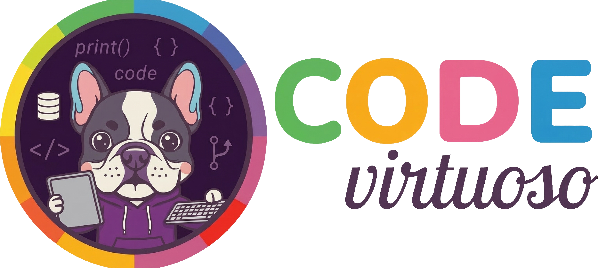

# Code Virtuoso

AI agent skill sets for software engineering — built on the [Agent Skills](https://agentskills.io) open standard. Knowledge, Tools, Frameworks, and Playbooks.

Four categories of skills, installable independently or as bundles:

- **Knowledge** — Design Patterns, Refactoring, SOLID Principles, Debugging, Clean Architecture, Testing, API Design, Security, Scrum, Performance, Microservices, Git Workflow, CI/CD, Accessibility, Database Design. Reference material with progressive disclosure.
- **Tools** — Agentic Rules Writer. Agent configuration and bootstrapping tools.
- **Frameworks** — Symfony Components, Symfony Upgrade, Django Components. Component-level reference and version upgrade guides for framework-specific development.
- **Playbooks** — PHP Upgrade, Composer Dependencies. Step-by-step operational procedures for recurring maintenance tasks.

---

## Installation

```bash
# Interactive — select skills and agents to install
npx skills add krzysztofsurdy/code-virtuoso

# Install specific skills
npx skills add krzysztofsurdy/code-virtuoso --skill design-patterns --skill refactoring

# Install all skills to all agents
npx skills add krzysztofsurdy/code-virtuoso --all

# Install globally (available in all projects)
npx skills add krzysztofsurdy/code-virtuoso -g

# List available skills without installing
npx skills add krzysztofsurdy/code-virtuoso --list
```

### Keeping Skills Updated

```bash
# Check for available updates
npx skills check

# Update all installed skills to latest versions
npx skills update
```

#### Auto-update (once daily, background)

**macOS / Linux** — runs silently on each new shell, at most once per day:

```bash
echo '_skills_marker="${TMPDIR:-/tmp}/.skills-updated-$(date +%Y%m%d)"
[ ! -f "$_skills_marker" ] && (npx skills update --yes >/dev/null 2>&1 && touch "$_skills_marker" &)' >> ~/.zshrc
```

**Windows (PowerShell)** — same behavior, once per day on shell startup:

```powershell
Add-Content $PROFILE '$marker = "$env:TEMP\.skills-updated-$(Get-Date -Format yyyyMMdd)"; if (-not (Test-Path $marker)) { Start-Job { npx skills update --yes *> $null; New-Item $using:marker -Force } | Out-Null }'
```

**Project-level** — auto-update after every `git pull` via post-merge hook:

```bash
printf '#!/bin/sh\nnpx skills update --yes >/dev/null 2>&1 &\n' > .git/hooks/post-merge && chmod +x .git/hooks/post-merge
```

---

## Knowledge Skills

| Skill | Summary |
|-------|---------|
| [Design Patterns](skills/knowledge/design-patterns/SKILL.md) | 26 Gang of Four patterns with PHP 8.3+ implementations |
| [Refactoring](skills/knowledge/refactoring/SKILL.md) | 67 refactoring techniques and 22 code smells |
| [SOLID](skills/knowledge/solid/SKILL.md) | All five SOLID principles with multi-language examples |
| [Debugging](skills/knowledge/debugging/SKILL.md) | Systematic debugging methodology and post-mortem templates |
| [Clean Architecture](skills/knowledge/clean-architecture/SKILL.md) | Clean/Hexagonal Architecture and DDD fundamentals |
| [Testing](skills/knowledge/testing/SKILL.md) | Testing pyramid, TDD schools, test doubles, strategies |
| [API Design](skills/knowledge/api-design/SKILL.md) | REST and GraphQL design principles and evolution strategies |
| [Security](skills/knowledge/security/SKILL.md) | OWASP Top 10, auth patterns, secure coding practices |
| [Scrum](skills/knowledge/scrum/SKILL.md) | Sprint goals, events, roles, and facilitation templates |
| [Performance](skills/knowledge/performance/SKILL.md) | Profiling, caching, database optimization, N+1 prevention |
| [Microservices](skills/knowledge/microservices/SKILL.md) | Saga, CQRS, event sourcing, circuit breakers, service mesh |
| [Git Workflow](skills/knowledge/git-workflow/SKILL.md) | Branching strategies, commit conventions, PR patterns, release management |
| [CI/CD](skills/knowledge/cicd/SKILL.md) | Pipeline design, deployment strategies, environment promotion |
| [Accessibility](skills/knowledge/accessibility/SKILL.md) | WCAG compliance, ARIA patterns, keyboard navigation, a11y testing |
| [Database Design](skills/knowledge/database-design/SKILL.md) | Schema modeling, indexing strategies, migration patterns, temporal data |

## Tool Skills

| Skill | Summary |
|-------|---------|
| [Agentic Rules Writer](skills/tools/agentic-rules-writer/SKILL.md) | Generate rules files for Claude Code, Cursor, Windsurf, Copilot, Gemini, Roo Code, or Amp |

## Framework Skills

| Skill | Summary |
|-------|---------|
| [Symfony Components](skills/frameworks/symfony/symfony-components/SKILL.md) | 38 Symfony components for PHP 8.3+ and Symfony 7.x |
| [Symfony Upgrade](skills/frameworks/symfony/symfony-upgrade/SKILL.md) | Deprecation-first upgrade guide for minor and major Symfony versions |
| [Django Components](skills/frameworks/django/django-components/SKILL.md) | 33 Django components for Python 3.10+ and Django 6.0 |

## Playbook Skills

| Skill | Summary |
|-------|---------|
| [PHP Upgrade](skills/playbooks/php-upgrade/SKILL.md) | PHP version upgrade process with Rector, PHPCompatibility, and per-version breaking changes |
| [Composer Dependencies](skills/playbooks/composer-dependencies/SKILL.md) | Safe dependency update strategies, security auditing, and automated update tools |

## Agents

| Agent | Skill | Summary |
|-------|-------|---------|
| [Scrum Master](skills/knowledge/scrum/agents/scrum-master.md) | Scrum | Sprint planning, goal crafting, retrospectives, impediment resolution |

---

## Repository Structure

```
code-virtuoso/
├── skills/
│   ├── knowledge/
│   │   ├── api-design/
│   │   ├── clean-architecture/
│   │   ├── debugging/
│   │   ├── design-patterns/
│   │   ├── refactoring/
│   │   ├── microservices/
│   │   ├── cicd/
│   │   ├── git-workflow/
│   │   ├── accessibility/
│   │   ├── database-design/
│   │   ├── performance/
│   │   ├── scrum/
│   │   │   └── agents/           # Co-located agents
│   │   ├── security/
│   │   ├── solid/
│   │   └── testing/
│   ├── frameworks/
│   │   ├── django/
│   │   │   └── django-components/
│   │   └── symfony/
│   │       ├── symfony-components/
│   │       └── symfony-upgrade/
│   ├── playbooks/
│   │   ├── php-upgrade/
│   │   └── composer-dependencies/
│   └── tools/
│       └── agentic-rules-writer/
├── spec/                          # Format specifications
│   ├── agent-skills-spec.md
│   ├── skill-spec.md
│   └── agent-spec.md
├── template/                      # Starter templates
│   ├── SKILL.md
│   └── agent.md
├── CONTRIBUTING.md
├── LICENSE
└── README.md
```

## Recommended Companion Tools

### Beads — Task Memory for AI Agents

[github.com/steveyegge/beads](https://github.com/steveyegge/beads)

A distributed, git-backed graph issue tracker that gives AI agents persistent, structured memory for long-horizon tasks. Replaces ad-hoc markdown planning files with a dependency-aware task graph stored in a version-controlled database.

### GSD — Spec-Driven Development

[github.com/gsd-build/get-shit-done](https://github.com/gsd-build/get-shit-done)

A meta-prompting and context engineering system for Claude Code, OpenCode, Gemini CLI, and Codex. Solves context rot — the quality degradation that happens as Claude fills its context window. Spec-driven development with subagent orchestration and state management.

### Grepika — Token-Efficient Code Search

[github.com/agentika-labs/grepika](https://github.com/agentika-labs/grepika)

An MCP server that replaces built-in grep/file search with ranked, compact results using ~80% fewer tokens. Combines FTS5 full-text search, parallel grep, and trigram indexing with BM25 ranking.

## Contributing

See [CONTRIBUTING.md](CONTRIBUTING.md) for guidelines on adding or improving skills.

## License

MIT
